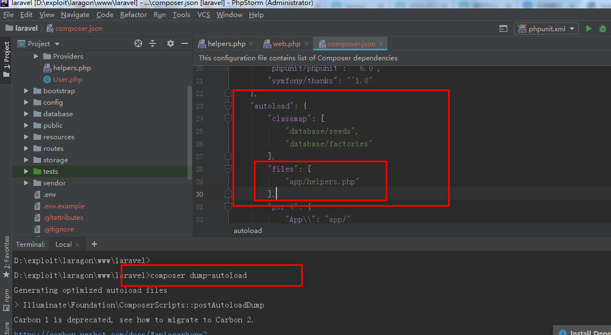
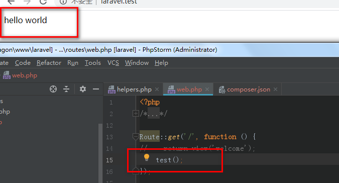
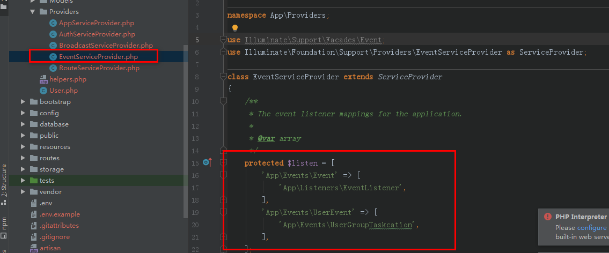
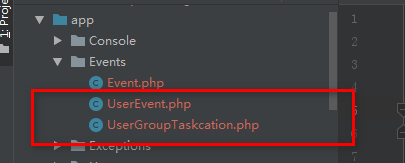

# 「laravel网站」

<a href="https://learnku.com/">laravel China社区 </a>

<a href="https://learnku.com/docs/laravel-specification/7.x">Laravel 项目开发规范</a>

# 「目录结构」

## 自定义函数的存放位置

问题：

​	我们的应用里经常会有一些全局都可能会用的函数，我们应该怎么放置它会比较好呢？以下有一种推荐的方式。

方案：

​	1、创建文件 app/helpers.php

```php
<?php

// 示例函数
function foo() {
    return "foo";
}
```

​	2、修改项目 composer.json

​	在项目 composer.json 中 autoload 部分里的 files 字段加入该文件即可：

```json
{
    ...

    "autoload": {
        "files": [
            "app/helpers.php"
        ]
    }
    ...
}
```

3、然后运行:

```bash
$ composer dump-autoload
```





# 「路由」

## 资源路由

必须 优先使用 Restful 路由，配合资源控制器使用


### resource 方法正确使用

一般资源路由定义：

```php
Route::resource('photos', 'PhotosController');
```

等于以下路由定义：

```php
Route::get('/photos', 'PhotosController@index')->name('photos.index');
Route::get('/photos/create', 'PhotosController@create')->name('photos.create');
Route::post('/photos', 'PhotosController@store')->name('photos.store');
Route::get('/photos/{photo}', 'PhotosController@show')->name('photos.show');
Route::get('/photos/{photo}/edit', 'PhotosController@edit')->name('photos.edit');
Route::put('/photos/{photo}', 'PhotosController@update')->name('photos.update');
Route::delete('/photos/{photo}', 'PhotosController@destroy')->name('photos.destroy');
```

使用  **resource**  方法时，如果仅使用到部分路由，必须 使用  **only**  列出所有可用路由：

```php
Route::resource('photos', 'PhotosController', ['only' => ['index', 'show']]);
```

**绝不** 使用 `except`，因为 `only` 相当于白名单，相对于 `except` 更加直观。路由使用白名单有利于养成『安全习惯』。

## 路由模型绑定

​	当向路由或控制器行为注入模型 ID 时，就需要查询这个 ID 对应的模型。Laravel 为路由模型绑定提供了一个直接自动将模型实例注入到路由中的方法。例如，你可以注入与给定 ID 匹配的整个 User 模型实例，而不是注入用户的 ID。

### 隐式绑定

​	Laravel 会自动解析定义在路由或控制器行为中与类型提示的变量名匹配的路由段名称的 Eloquent 模型。例如：

```php
Route::get('api/users/{user}', function (App\User $user) {
    return $user->email;
});
```

​	在这个例子中，由于 $user 变量被类型提示为 Eloquent 模型 App\User，变量名称又与 URI 中的 {user} 匹配，因此，Laravel 会自动注入与请求 URI 中传入的 ID 匹配的用户模型实例。如果在数据库中找不到对应的模型实例，将会自动生成 404 异常。

#### 自定义键名

​	如果你想要模型绑定在检索给定的模型类时使用除 `id` 之外的数据库字段，你可以在 Eloquent 模型上重写 `getRouteKeyName` 方法：

```php
/**
 * 为路由模型获取键名。
 *
 * @return string
 */
public function getRouteKeyName()
{
    return 'slug';
}
```

### 显式绑定

要注册显式绑定，使用路由器的 `model` 方法来为给定参数指定类。在 `RouteServiceProvider` 类中的 `boot` 方法内定义这些显式模型绑定：

```php
public function boot()
{
    parent::boot();

    Route::model('user', App\User::class);
}
```

接着，定义一个包含 `{user}` 参数的路由：

```php
Route::get('profile/{user}', function (App\User $user) {
    //
});
```

​	因为我们已经将所有 {user} 参数绑定至 App\User 模型，所以 User 实例将被注入该路由。例如，profile/1 的请求会注入数据库中 ID 为 1 的 User 实例。

如果在数据库不存在对应 ID 的数据，就会自动抛出一个 404 异常。

### 使用路由模型绑定

在允许使用路由 <a href="https://learnku.com/docs/laravel/5.5/routing/1293#route-model-binding">模型绑定</a> 的地方 必须 使用。

模型绑定代码 必须 放置于 **app/Providers/RouteServiceProvider.php** 文件的 **boot** 方法中：

```php
  public function boot()
    {
        Route::bind('user_name', function ($value) {
            return User::where('name', $value)->first();
        });

        Route::bind('photo', function ($value) {
            return Photo::find($value);
        });

        parent::boot();
    }
```


## 路由命名

除了 **resource**  资源路由以外，其他所有路由都 必须 使用 name 方法进行命名。

必须 使用『资源前缀』作为命名规范，如下的 **users.follow**，资源前缀的值是 **users.**：

```php
Route::post('users/{id}/follow', 'UsersController@follow')->name('users.follow');
```

## 中间件

​	要给路由组中所有的路由分配中间件，可以在 `group` 之前调用 `middleware` 方法。中间件会依照它们在数组中列出的顺序来运行：

```php
Route::middleware(['first', 'second'])->group(function () {
    Route::get('/', function () {
        // 使用 first 和 second 中间件
    });

    Route::get('user/profile', function () {
        // 使用 first 和 second 中间件
    });
});
```


# 「用户登录JWT」


[laravel JWTAuth实现api接口鉴权(基础篇) - 木公007 - 博客园 (cnblogs.com)](https://www.cnblogs.com/mg007/p/10979469.html)

https://learnku.com/articles/10885/full-use-of-jwt

## auth配置项


storage_key：携带验证令牌，存储key，

```php
    'guards' => [
        'web' => [
            'driver' => 'session',
            'provider' => 'users',
            'storage_key' => 'Authorization',
        ],

        'api' => [
            'driver' => 'jwt', // token
            'provider' => 'users',
        ],
    ],
```

## 方法

让一个 token 无效: JWTAuth::parseToken()->invalidate();

```PHP
// 更新 token。
$newToken = JWTAuth::parseToken()->refresh();

// 让一个 token 无效。
JWTAuth::parseToken()->invalidate();

// 检验 token 的有效性。
if(JWTAuth::parseToken()->check()) {
    dd("token是有效的");
}
```


检验 token 的有效性: JWTAuth::parseToken()->check()

# 「验证」

## 手动返回错误

```php
$not_pass_data = Validator::make($request->all(), [
    'user_name' => 'required',
    'account' => 'required|unique:users',
    'password' => 'required|min:6',
    'password2' => 'required|min:6',
    'gender' => 'integer',
]); // 设置错误规则
$errors = $not_pass_data->errors(); // 获取错误对象
$messages = $errors->getMessages(); // 获取错误数组信息
```

# 「 模型」

## 初始化

```php
protected $primaryKey = 'menu_id';
protected $table = 'menus';
protected $fillable = ['parent_id', 'menu_name', 'icon', 'description', 'path'];
// 注: create()方法必须跟$fillable和...联合使用
// $fillable可以添加的字段
public $timestamps = false; // udpate_at、create_at 是否时间戳自动添加

```


## select限制显示字段

1、selectRaw作用：可以把字段写在字符串中，跟DB:raw(select("field..."))一样;

```php
$fild = 'user_id, count(*)';
$res = self::menuWhere($where)
            ->selectRaw($fild)
            ->orderBy('parent_id')
            ->get();
```

## first获取单条记录

```php
$model->first();
```

没有数据则返回null

否则对象

## 关联


### 联表查询

语法：

​	DB门面->table()->join联表方式名称(关联的表名, 表1的字段, 运算符, 表2的字段)

### 关联模型hasOne一对一

public function 被关联的模型名小写() {

​	return $this->hasOne('需要关联模型的命名空间'， ‘被关联模型的关联字段‘， ’本模型中的关联字段’);

}

```php
namespace App;
class Authors {
    
}

class Article {
    public function rel_authors() {
        return $this->hasOne('App\Authors', 'id', 'author_id');
    }
}
```

关联关系被定义后，我们可以使用 Eloquent 的[动态属性](http://laravelacademy.org/tags/动态属性)获取关联记录。动态属性允许我们访问关联函数就像它们是定义在模型上的属性一样：

```php
$article = new \App\Article();
$data = $article->find(1);
$authors = $data->rel_authors; // 使用动态属性获取关联记录 获取作者模型对象
$authors->author_name; // 作者名称
```


### 关联模型一对多

语法：

​	public function 被关联的模型名() {

​		return $this->hasMany('需要关联模型的命名空间', '被关联模型的关联字段', '本模型中关联字段');

​	}

实例：

​	查找一个作者下多遍文章

```php
namespace App;
class Authors {
    public function rel_article() {
        retrun $this->hasMany('App\Article', 'author_id', 'id');
    }
}

class Article {
    
}
```


### 关联模型多对多

​	多对多关联通过编写一个调用 Eloquent 基类上的belongsToMany方法的函数来定义，

语法：

public function 被关联的模型名小写() {

​	return $this->belongsToMany('需要关联模型的命名空间', 'er图交集表', '本模型中在er图交集表的关联字段', '被关联模型在er图交集表中的关联字段')

}

实例：

​	例如，一遍文章有对个关键字，一个关键字被多遍文章使用，所以这两个实体之间是多对多关系，它们之间有个文章关键字表来连接。

​	文章表：Article，关键字表：article_wordkey，文章关键字表：article_wordkey

article_wordkey字段:

id   article_id   wordkey_id

求：文章下的关键字

```php
namespace App;

class Article {
    public function rel_wordKey() {
        retrun $this->belongsToMany('App\Wordkey', 'article_wordkey', 'article_id', 'wordkey_id')
    }
}

class Wordkey {
    
}
```

### with方法

```php

/**
* 关联方法
* @return \Illuminate\Database\Eloquent\Relations\HasMany
*/
public function goods()
{
    return $this->hasMany(Good::class);
}

/**
* 使用with关联查询
* with relactionFunciton
*/
public function category($categoryId)
{
    $category = Category::with('goods')->find($categoryId);
    return $category;
}

/**
* with条件关联查询
*/
public function category($categoryId)
{
    $category = Category::with(['goods' => function ($query) {
        $query->where('is_sale', true); // 定义查询方法
    }])->find($categoryId);
    return $category;
}
```

### has()方法

​		has()方法可以用来查询是否有关联关系的一个方法，**就是判断这个里面有没有值**

```php
#has(关联方法)
$packageOrders = Company::has('packages')->get();
```

### whereHas()方法

​		whereHas()方法的原理基本和has()方法相同，但是他允许你自己添加对这个模型的过滤条件。

```php
$userCoupons = UserCoupons::whereHas('coupon', function($query) use($groupId){
        return $query->select('id', 'group_id', 'cover', 'group_number', 'group_cover')
            ->where(['group_id' => $groupId,]); 
})->with(['coupon' => function($query) use($groupId){
        return $query->select('id', 'group_id', 'cover', 'group_number', 'group_cover');
 }])-> // ...
```


## 方法

1、增

Model::insert(array) 返回boolean

Model::insertGetId(array)  添加成功返回自增id

$ob->save


2、查询一**列**（pluck）

```php
DB::table('table_name')->where('brand_id','100')->pluck('goods_id');
```

直接查询一个字段（value）

value(field) ： 获取某个字段的一个值

```php
$user_ids = Users::where(['is_del' => 0, 'status' => 1])->whereIn('group_id', $executor)-> value('user_id'); // 1
```


# 「缓存系统」

## 1.设置缓存

### 1.1 put方法

```php
# Key:键  Value：值 $minutes：有效期，单位是分钟
Cache::put('key', 'value', $minutes);
```

注意：**如果该键已经存在，则直接覆盖原来的值**，有效期必须设置，单位是分钟

### 1.2 add()方法

```php
# Key:键  Value：值 $minutes：有效期，单位是分钟
Cache::add('key', 'value', $minutes);
```

add **方法只会在缓存项不存在的情况下添加数据到缓存**，如果数据被成功添加到缓存返回 true，否则，返回false：

### 1.3 forever()方法永久存储数据

```php
# Key:键  Value：值
Cache::forever('key', 'value');
```

​		forever方法用于持久化存储数据到缓存，这些值必须通过 **forget 方法手动从缓存中移除**：永久存储并不是真的永久，只不过其截至的时间是比较大的值（到2286年）

## 2.获取缓存数据

### 2.1 get()方法

```php
$value = Cache::get('key');			#获取指定的key值
$value = Cache::get('key', 'default');	#获取指定的key值，如果不存在，则使用默认值
```

​	Cache 门面的 get 方法用于从缓存中获取缓存项，**如果缓存项不存在，返回 null**。如果需要的话你可以传递**第二个参数到 get 方法指定缓存项不存在时返回的自定义默认值**

### 2.2 get()方法的闭包函数

```php
$value = Cache::get('key', function() {
    return DB::table(...)->get();
});
```

​	可以传递一个匿名函数作为默认值，如果缓存项不存在的话闭包的结果将会被返回。传递匿名函数允许你可以从数据库或其它外部服务获取默认值。

## 3.检查缓存项是否存在

has 方法用于判断缓存项是否存在

```php
if (Cache::has('key')) {
    //
}
```

## 4.删除缓存数据

### 4.1 pull()方法

```php
$value = Cache::pull('key')
```

从缓存中**获取缓存项**然后删除，**如果缓存项不存在的话返回null，一般设置一次性的存储的数据**

## 4.2 forget() 方法

```php
Cache::forget('key');
```

使用forget 方法从缓存中移除缓存项数据

## 4.2 flush()方法

```php
Cache::flush();
```

使用 flush 方法 **清除所有缓存,并且删除对应的目录**

## 5.缓存数值增加/减少

```php
# increment 和 decrement 方法可用于调整缓存中的整型数值。这两个方法都可以接收第二个参数来指明缓存项数值增加和减少的数目：一般会用作计数器。
Cache::increment('key');
Cache::increment('key', $amount);
Cache::decrement('key');
Cache::decrement('key', $amount);
```

注：如果用计数器，则在初始化的时候不能使用**put**和**forever**，因为这2个方法都会重复的初始化计数器。

## 6.获取并存储【重点】

​		有时候你可能想要获取缓存项，但如果请求的缓存项不存在时给它**存储**一个默认值。例如，你可能想要从缓存中获取所有用户，或者如果它们不存在的话，**从数据库获取它们并将其添加到缓存中，你可以通过使用 Cache::remember 方法实现**

​	**当该缓存项不存在时，触发添加（存储）操作**

```php
# Key:键  $minutes：有效期,单位是分钟  回调函数（获取数据的函数）
$value = Cache::remember('key', $minutes, function() {
    return DB::table('users')->get();
});

# 判断给定的key是否存在，如果不存在就触发回调函数，把回调函数return的值赋值给key
```


你还可以使用 `rememberForever` 方法从缓存中查找数据或**永久存储**它

```php
$value = Cache::rememberForever('users', function() {
    return DB::table('users')->get();
});
```


# 「事件」

## 1.注册事件和监听器

Laravel 应用中的 `EventServiceProvider` 有个 `listen` 数组包含所有的事件（键）以及事件对应的监听器（值）来注册所有的事件监听器，可以灵活地根据需求来添加事件。

</img>

## 2.生成事件 & 监听器

```bash
php artisan event:generate
```

</img>

## 3.定义事件

```php
<?php

namespace App\Events;

use ...

class UserEvent
{
    use Dispatchable, InteractsWithSockets, SerializesModels;

    public $user;
    public $not;
    /**
     * Create a new event instance.
     *
     * @return void
     */
    public function __construct($user, array $not)
    {
        $this->user = $user;
        $this->not = $not;
    }

    /**
     * Get the channels the event should broadcast on.
     *
     * @return \Illuminate\Broadcasting\Channel|array
     */
    public function broadcastOn()
    {
        return new PrivateChannel('channel-name');
    }
}

```

## 4.定义监听器

```php
<?php

namespace App\Events;

use App\Events\User;
use Illuminate\Queue\InteractsWithQueue;
use Illuminate\Contracts\Queue\ShouldQueue;

class UserGroupTaskcation
{
    /**
     * Create the event listener.
     *
     * @return void
     */
    public function __construct()
    {
        //
    }

    /**
     * Handle the event.
     *
     * @param  User  $event
     * @return void
     */
    public function handle(UserEvent $event)
    {

        if ($event->not['groutTask']) {
            dump('分发任务');
        } else {
            echo 'no';
        }
    }
}

```

## 5.触发事件

```php
Route::get('userEvent', function () {
    $user = ['user_id' => 1, 'user_name' => 'yang'];
    $not = ['groutTask' => false];
    event(new \App\Events\UserEvent($user, $not));
});
```

## 6.停止事件传播

你可以通过在监听器的 `handle` 方法中返回 `false` 来阻止事件被其他的监听器获取。

```php
class UserGroupTaskcation
{
    /**
     * Handle the event.
     *
     * @param  User  $event
     * @return void
     */
    public function handle(UserEvent $event)
    {

        return false;
    }
}
```

注：当该监听器中被return false时，在`listen` 容器中，该事件中以被return false以下的监听器不会被执行。

</img>

# 「 报错」

## vue 类型

### node.js版本变更

1. npm rebuild node-sass

   错误信息：

   

   解决：执行npm rebuild node-sass


## upload文件上次

### 419错误

第一种

```php
找到app/Http/Middleware文件，把
 
protected $except = [
    //
];改为
protected $except = [
    '*'
];
```

第二种


