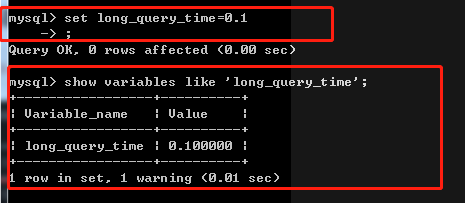
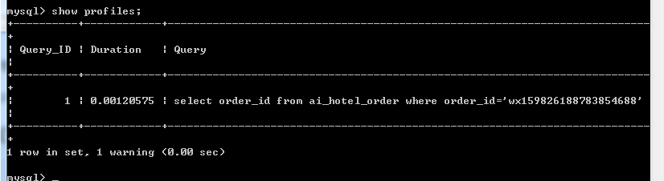

# 查找需要优化的sql语句

## 1.慢查询日志

### 1.1 临时启动慢查询日志

#### 1. 开启

需在mysql关闭下设置。

```bash
mysqld.exe --safe-mode --slow-query-log
or
mysqld.exe --slow-query-log
```

#### 2.可以通过命令查看慢查询日志的时间

```bash
show variables like 'long_query_time'
```


#### 3.修改慢查询日志记录时间

```bash
set long_query_time=0.5
```




4.测试查询


## 2.精确记录查询时间

使用mysql提供profile机制完成

profile记录每次执行的SQL语句的具体时间，精确时间到小数点8位

### (1) 开启profile机制

```bash
set profiling=1;
```

### (2) 查询记录sql语句的执行时间

```bash
show profiles;
```



### (3) 关闭profile

```bash
set profiling=0;
```

